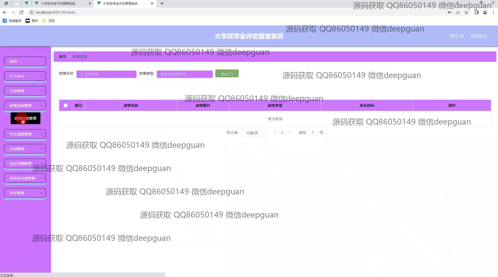

<h1 align="center">陕西理工大学奖学金评定管理系统的开发</h1>

## 简介
陕西理工大学奖学金评定管理系统：角色分为管理员、教师、学生；功能包括奖学金申请管理、学生成绩管理、信息录入与审核、活动管理等，以简洁的界面和高效操作提升评定流程透明度和效率    --计算机毕业设计源码；毕设源码；java毕业设计源码

## 联系方式

<h3 align="center">获取完整代码与数据库文件 + 微信：deepguan QQ: 86050149 QQ群: 783742310</h3>

<h3 align="center">可帮忙远程部署 包运行成功！提供远程部署、修改代码、设计文档指导、代码讲解等服务！</h3>

## 功能介绍（完整见运行截图）
管理员：管理员可以通过系统进行奖学金申请的审核和管理，包括查看申请详情、录入和编辑学生信息、管理奖项设置等。管理员还负责维护系统公告和政策信息，保障学年管理、活动奖项以及学生成绩管理等模块的顺利运行。此外，管理员能够查看和分析评审结果，确保评定过程的透明性和公正性，同时管理学生和老师用户的账号权限以及系统的安全设置。

学生：学生可以通过系统提交奖学金申请，填写相关申请表格如申请编号、标题和理由等，查看自己的申请状态和结果。学生还可以访问个人中心查看和修改个人信息，查询自己的成绩、学年综合评定等数据。系统提供了详细的公告、政策信息以及活动相关信息供学生浏览，以便更好地参与学校的各项资源和政策。同时，学生可通过系统与管理员进行沟通，以便及时了解评定进度和修改申请信息。

老师：老师在系统中可以负责学生成绩的管理和录入，并且审核和编辑学生提交的奖学金申请资料。老师还可以根据活动参与情况和绩效贡献来评定学生的活动积分和德育得分，为奖学金评定提供数据支持。系统允许老师查看历届及当前的奖学金评定政策，以便公正透明地辅导学生，同时，通过公告管理了解最新的政策变化和评定规则，更好地帮助学生规划和准备申请材料。

访客：访客角色一般指新生或者对系统外部访问的人员，能够查看到系统的基本政策信息和公告，了解学校提供的奖学金种类、申请流程和所需条件等基本信息。但不具备提交申请或查看详细成绩信息的权限，仅能浏览公开信息。这一角色的设计旨在帮助潜在申请人或系统新用户快速熟悉平台的运作方式和奖学金申请机制。

## 运行截图

本代码来源于网络,仅供学习参考使用!

